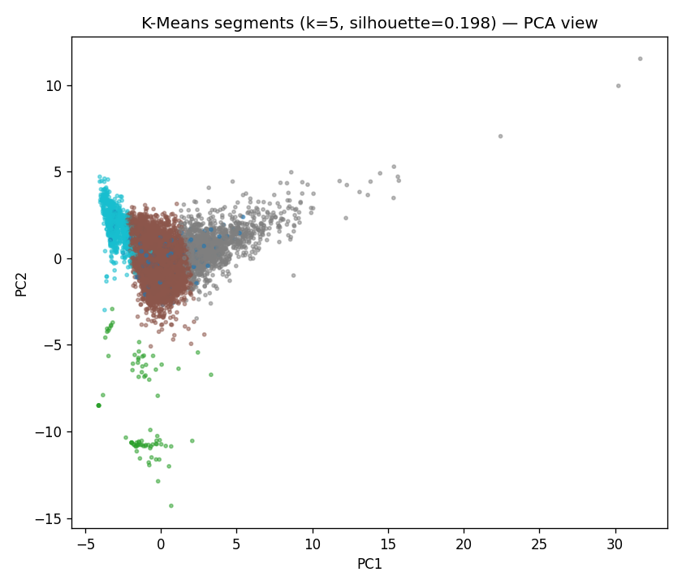
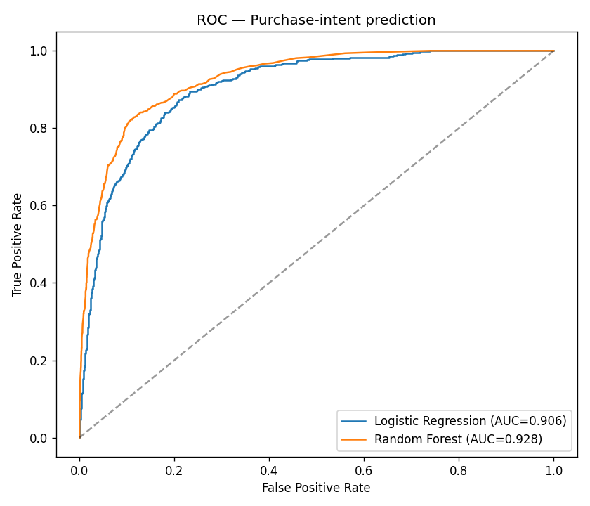

# E-Commerce Customer Segmentation & Purchase-Intent Prediction 🛍️

**Segment 12,330 online shopping sessions into behavioral groups and predict which sessions will convert to a purchase — turning clickstream behavior into marketing-ready customer intelligence.**

  

---

## 💼 Business problem
Most e-commerce sessions never convert. Two questions drive retention and marketing spend:
1. **Who are our shoppers?** — group sessions into behavioral segments (browsers vs. buyers vs. researchers) for targeted campaigns.
2. **Will this session convert?** — score purchase intent in real time so the site can trigger nudges (offers, support) for high-intent visitors.

## 📊 Dataset
[UCI Online Shoppers Purchasing Intention](https://archive.ics.uci.edu/dataset/468/online+shoppers+purchasing+intention+dataset) — `data/Project2_Data.csv` + `data/Project2_Data_Labels.csv` (bundled).

- **12,330 sessions × 17 features** — page counts & durations (Administrative / Informational / ProductRelated), `BounceRates`, `ExitRates`, `PageValues`, `SpecialDay`, `Month`, tech attributes, `VisitorType`, `Weekend`.
- **Target:** `Revenue` (session ended in a purchase) — **~15.5% positive** (imbalanced).

## 🔬 Methodology
1. **EDA & preparation** — encoding, scaling, power transforms for skewed features.
2. **Segmentation** — **K-Means** (and Agglomerative clustering in the notebook), with **silhouette analysis** to choose *k*; segments visualized in 2-D via **PCA**, then characterized by behavior. A **KNN** classifier is trained to assign new sessions to a segment.
3. **Purchase-intent prediction** — **Logistic Regression vs Random Forest** with class-weighting for the 15.5% positive rate ([`src/segmentation_and_prediction.py`](src/segmentation_and_prediction.py)).

## 📈 Results

**Segmentation:** silhouette scan over *k* = 2–6 selects **5 behavioral segments** (silhouette ≈ 0.20). See `reports/figures/segments_pca.png`.

**Purchase-intent prediction (test set):**

| Model | Accuracy | Precision | Recall | F1 | ROC-AUC |
|---|---|---|---|---|---|
| **Random Forest** | **0.904** | **0.756** | 0.564 | **0.646** | **0.928** |
| Logistic Regression | 0.859 | 0.530 | 0.748 | 0.621 | 0.906 |

<p align="center">
  
  
</p>

**Takeaway:** Random Forest reaches **ROC-AUC 0.93** at predicting conversion on a 15.5%-positive problem; Logistic Regression trades precision for higher recall (0.75) — useful if the goal is to *catch* as many likely buyers as possible for a nudge. `PageValues` and product-related engagement dominate purchase intent.

> **Naming note:** this repo uses the `customer-churn-segmentation` slug for portfolio consistency, but the dataset is session-level **purchase intent / conversion** — the methodology (segmentation + behavioral classification) is identical to a churn workflow.

## ▶️ How to run
```bash
pip install -r requirements.txt
jupyter lab notebooks/clustering_knn_purchase.ipynb     # EDA + clustering + KNN (runs end-to-end)
python src/segmentation_and_prediction.py               # segmentation + prediction + figures
```

## 🛠️ Tech stack
`Python` · `pandas` · `scikit-learn` (KMeans, Agglomerative, KNN, RandomForest, PCA) · `mlxtend` · `Matplotlib` · `Seaborn`

## 🚀 Future improvements
- Profile each segment into named personas + recommended marketing action.
- Gradient boosting + SHAP for per-session intent reason codes; threshold tuned to nudge budget.

---
*Academic project (DAV 6150, Project 2), extended with silhouette-based segmentation and an imbalance-aware purchase-intent benchmark.*
